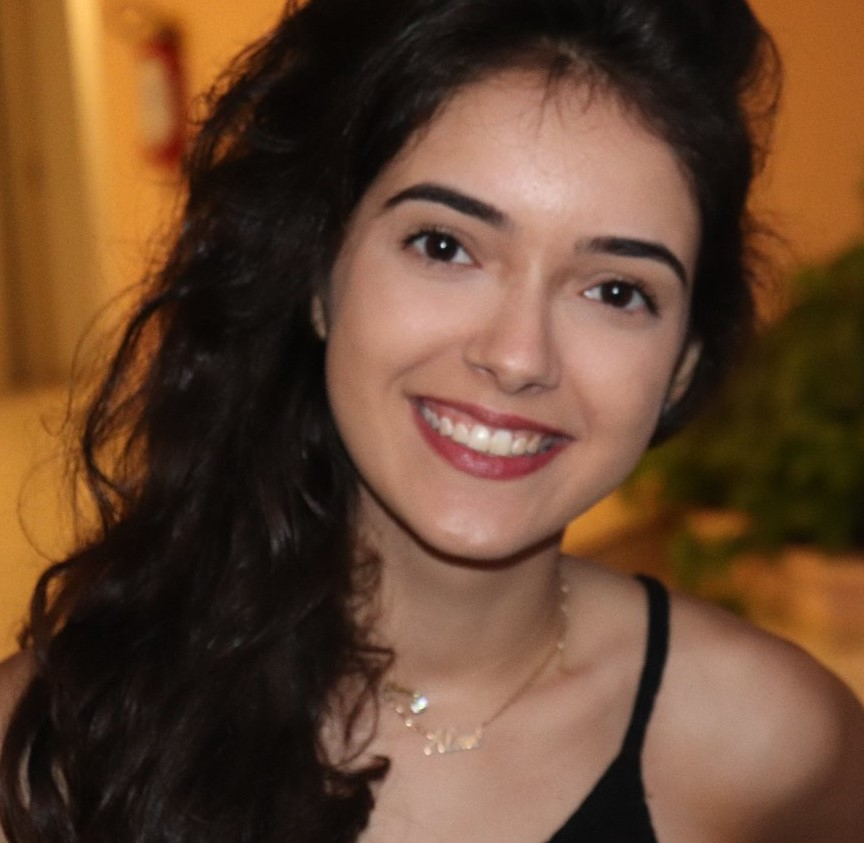

## Sobre Doarti
[Doarti](https://doarti.com.br/) é um projeto sem fins lucrativos, que busca disponibilizar uma plataforma digital que potencialize a construção de uma rede de ajuda (coleta e distribuição de doações). O projeto conta com a participação de professores do curso de Engenharia de Software, UnB/Gama, empresa de tecnologia Main Class e uma rede de profissionais, entre eles ex-alunos da Universidade.

O app Doarti se destina, tanto a doadores, quanto a beneficiários, os quais se encontrarão e irão estabelecer suas relações. Nele, pessoas que desejam doar podem encontrar Entidades Filantrópicas/Beneficentes e Projetos de Fabricação de equipamentos de saúde que precisam de ajuda, facilitando a relação entre essas partes.

## Equipe

  

    

      
      
Aline Helena Lermen

    

    

      
      
Ithalo Azevedo

    

    

      
      
Marcos Cabeceira

    

    

    

    

      
      
Marcos Vinicius

    

    

      
      
Victor Jorge

    

 

