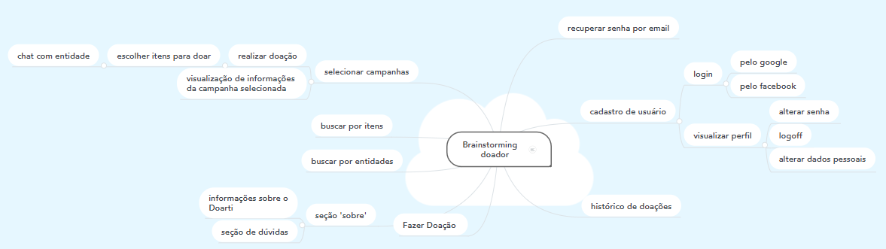

# Brainstorming 

O Brainstorming é uma atividade desenvolvida para explorar a potencialidade criativa de um indivíduo ou de um grupo. A técnica propõe que em uma reunião os membros sugiram qualquer pensamento ou ideia que venha a cabeça relacionados ao tema tratado. Dessa forma, a equipe aproveitará toda a diversidade de vivências, posicionamentos e ideias para gerar soluções inovadoras.

## Metodologia

O grupo utilizou uma plataforma online chamada [MindMeister](https://www.mindmeister.com/) para realizar o brainstorming. Através dele, todos os membros da equipe adicionaram suas ideias sobre os requisitos relacionados aos 2 tipos de usuário: doador e entidade. Depois disso, discutimos, filtramos e organizamos os requisitos avaliados.

### Brainstorming doador

### Brainstorming entidade

## Requisitos
## Referências
- https://www.mindmeister.com/
- https://rockcontent.com/br/blog/brainstorming/

## Históricos de Revisões

|    Data    | Versão |                   Descrição                   |                                  Autor(es)                                  |
| :--------: | :----: | :-------------------------------------------: | :-------------------------------------------------------------------------: |
| 25/09/2020 |  1.0   | Criação do documento | Ithalo Azevedo|
| 27/09/2020 |  1.0   | Adição dos printscreens do brainstorming | Ithalo Azevedo|