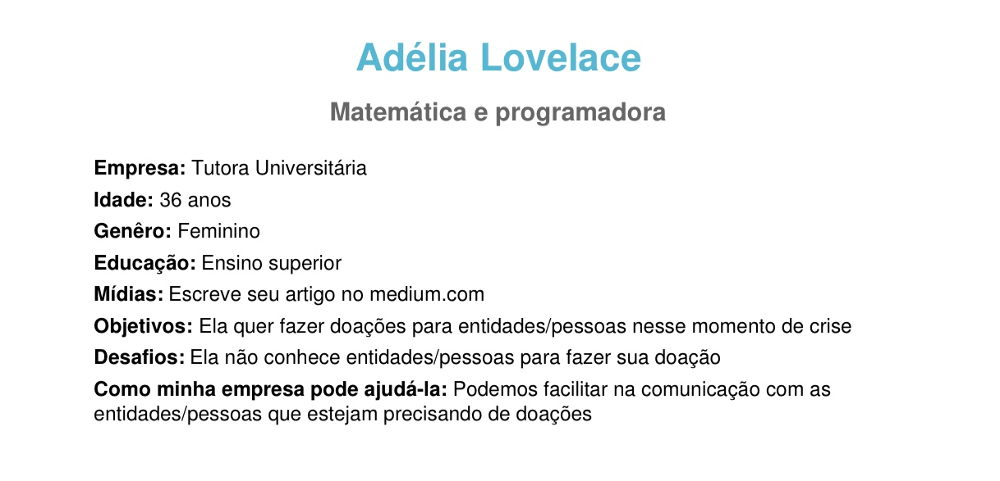
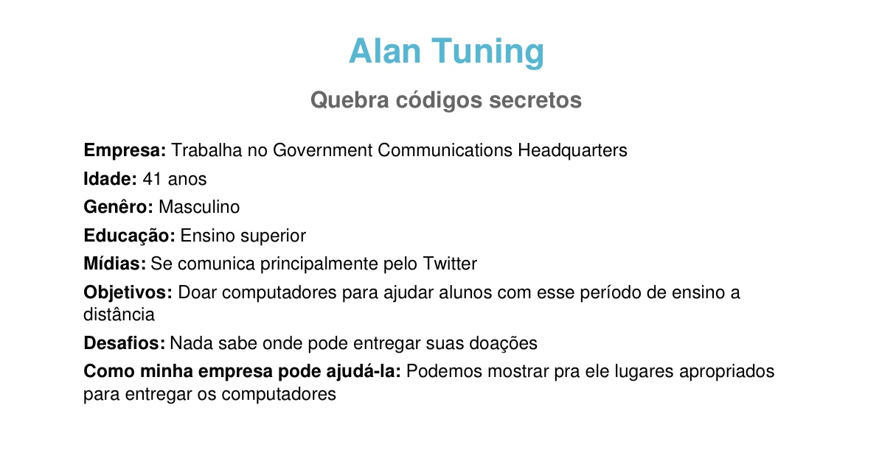
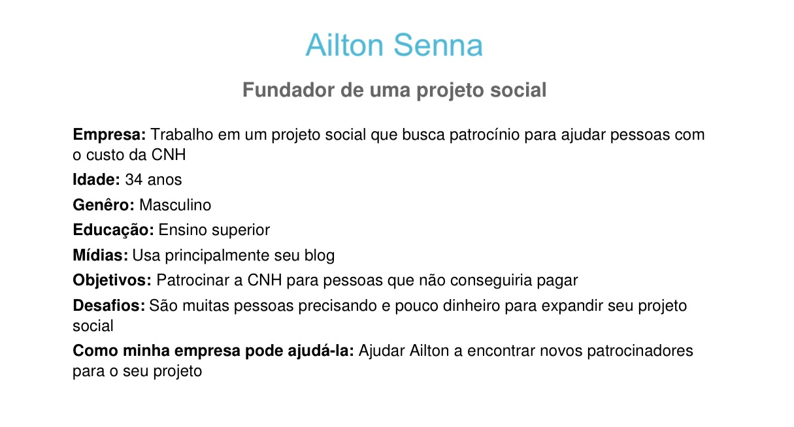
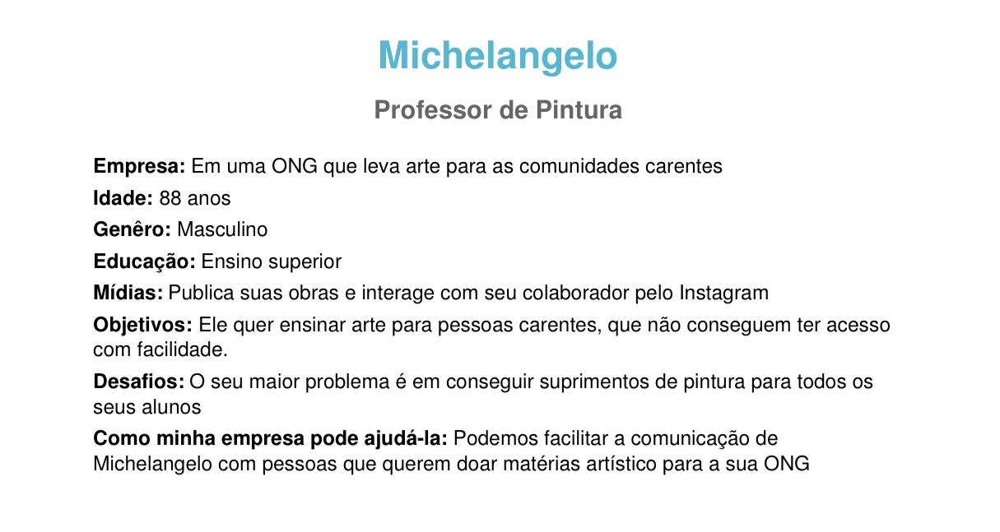

# Personas
As personas são personagens fictícios, baseadas em pessoas reais, levando em consideração comportamentos, personalidade, dificuldades, objetivos, satisfação e experiências. O uso das personas tem o objetivo de criar um perfil que sintetize as principais características do público-alvo do produto para que se consiga criar estratégias que satisfaça e atenda o público-alvo.

## Metodologia
Para o projeto, nossa equipe decidiu criar personas com comportamentos e dificuldades baseadas em pessoas conhecidas, possibilitando uma melhor noção dos objetivos e problemas que a persona pode encontrar. Para criar as personas, utilizamos [_O Fantástico Gerador de Personas de Marketing_](https://geradordepersonas.com.br/).

## Personas

### Persona 1

- Criador: Ithalo Azevedo
  

### Persona 2

- Criador: Ithalo Azevedo
  

### Persona 3

- Criador: Marcos Raimundo
  

### Persona 4

- Criador: Marcos Raimundo
  

### Persona 5

- Criador: Marcos Raimundo
  

### Persona 6

- Criador: Marcos Raimundo
  

## Referências

- O Fantástico Gerador de Personas de Marketing: <https://geradordepersonas.com.br/>.

## Históricos de Revisões

|    Data    | Versão |                    Descrição                    |   Autor(es)    |
| :--------: | :----: | :---------------------------------------------: | :------------: |
| 24/09/2020 |  1.0   |    Criação do documento e adição de personas    | Ithalo Azevedo |
| 26/09/2020 |  1.0   | Adição de metodologia e descrição da ferramenta | Ithalo Azevedo |
| 26/09/2020 | 1.1 | Adição de novas personas | Marcos Raimundo |
