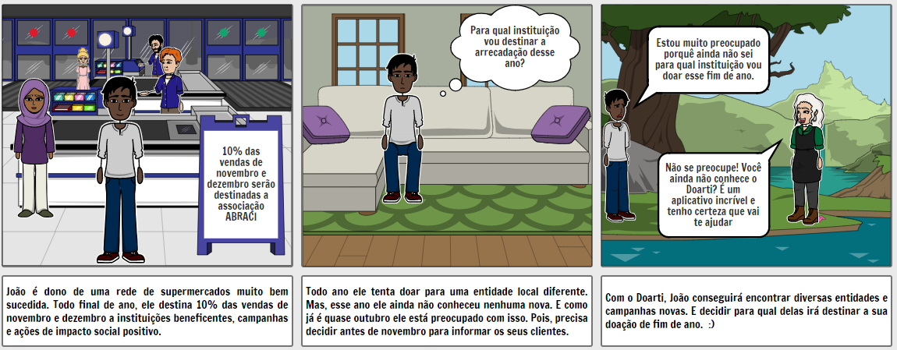
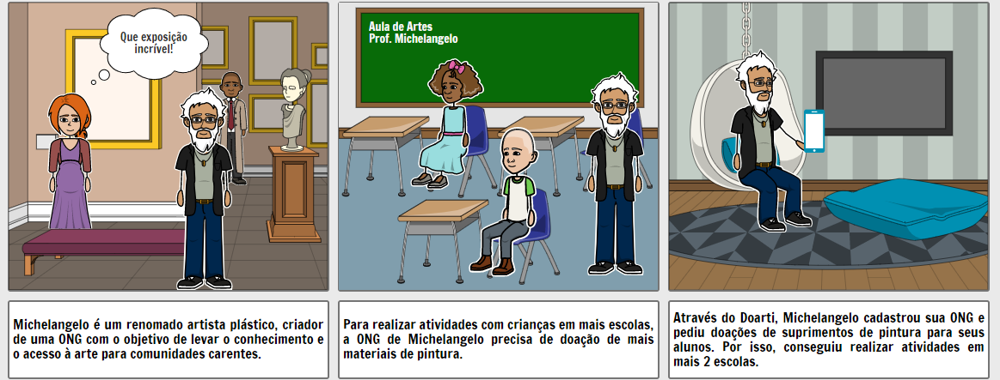

# Storyboard
Os storyboards são quadrinhos criados com o objetivo de elaborar e detalhar uma sequência narrativa. Essa ferramenta é muito utilizada em estúdios de animação para pré-visualizar filmes, em projetos de publicidade e, recentemente, é muito usado também na área de Engenharia de Software para fins de documentação. O principal objetivo é trazer a sequência narrativa de forma divertida, instigante e confortável para engajar o público.
## Metodologia
O storyboard foi criado através da ferramenta [Storyboard That](https://www.storyboardthat.com/pt) e utilizando as personas criadas pela equipe.

## Storyboard
- Criador: Ithalo Azevedo
  

- Criador: Ithalo Azevedo
  

## Requisitos elicitados
- O usuário doador deve poder pesquisar por entidades.
- O usuário doador deve poder conversar com entidades pelo chat.
- O usuário doador deve poder visualizar campanhas. 
- O usuário doador deve poder fazer doações. 

- O usuário entidade deve poder criar campanhas.
- O usuário entidade deve poder escolher o tipo de suprimento a ser doado.

## Referências
- https://www.storyboardthat.com/pt
- https://marcosnbj.github.io/2019.1-RocketChat/

## Históricos de Revisões

|    Data    | Versão |                  Descrição                   |   Autor(es)    |
| :--------: | :----: | :------------------------------------------: | :------------: |
| 28/09/2020 |  1.0   | Criação do documento e adição dos storyboards. | Ithalo Azevedo |