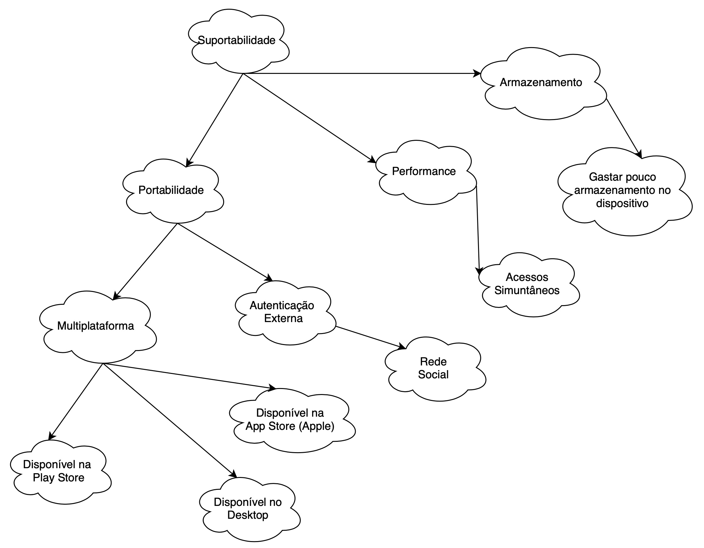
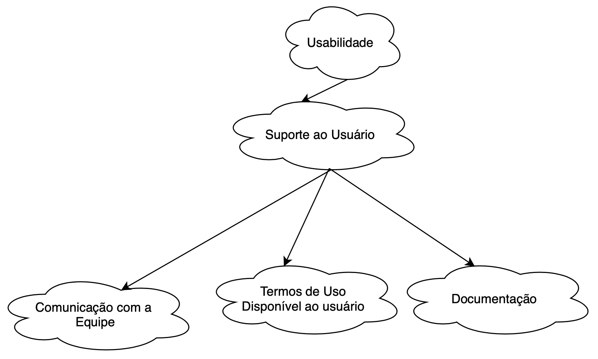

# NFR

## Introdução

Para a modelagem de requisitos não-funcionais, usamos o framework NRF (Non-functional Requirements Framework) pois ele nos permite ter uma noção sistemática e global dos requisitos não-funcionais da aplicação, buscando explorar as necessidades especificadas durante a fase de modelagem de requisitos e para entender como que um requisito impacta nos outros.

## Metodologia

Separamos os NFRs por temas de interesse e usamos o site [draw.io](https://draw.io) para elaborar os esquemas.

## Ferramentas

|                            |                                                                |
| -------------------------- | -------------------------------------------------------------- |
| **Nome**                   | **Descrição**                                                  |
| [draw.io](https://draw.io) | Draw IO é uma ferramenta famosa por sua criação de fluxogramas |

## NFR Suportabilidade

## NFR Confiabilidade

## NFR Usabilidade

## Histórico de Revisões

|    Data    | Versão |        Descrição         |                                               Autor(es)                                                |
| :--------: | :----: | :----------------------: | :----------------------------------------------------------------------------------------------------: |
| 27/10/2020 |  1.0   | Criação do documento NFR | [Marcos Raimundo](https://github.com/MarcosFloresta), [Marcos Cabeceira](https://github.com/Foxtrot40) |
| 27/10/2020 |  1.1   | Adição dos esquemas NFR  | [Marcos Raimundo](https://github.com/MarcosFloresta), [Marcos Cabeceira](https://github.com/Foxtrot40) |
