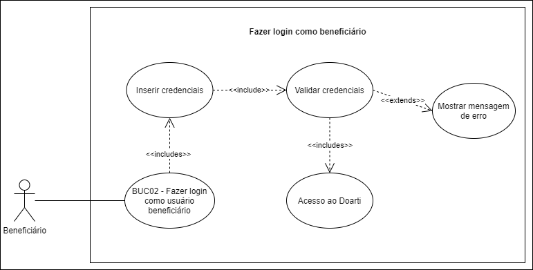

# BUC02 - Fazer login como usuário beneficiário

## Diagrama

## Descrição
O usuário beneficiário deve poder fazer login no aplicativo.

## Atores
Usuário beneficiário.

## Pré-requisitos
O usuário beneficiário deve ser cadastrado na aplicação.

## Fluxo de Eventos

### Fluxo Principal
1. O usuário beneficiário entra no aplicativo Doarti.
2. O usuário beneficiário seleciona o botão “PERFIL”.
3. O usuário beneficiário seleciona o botão “SOU ENTIDADE”.
4. O usuário beneficiário preenche o formulário de login.
5. O usuário beneficiário seleciona o botão “ENTRAR”.
6. O sistema valida as credenciais.
7. O usuário beneficiário passa a estar logado.

### Fluxos de Exceção
**FE01**: Credenciais inválidas
1. O usuário beneficiário entra no aplicativo Doarti.
2. O usuário beneficiário seleciona o botão “PERFIL”.
3. O usuário beneficiário seleciona o botão “SOU ENTIDADE”.
4. O usuário beneficiário preenche o formulário de login.
5. O usuário beneficiário seleciona o botão “ENTRAR”.
6. O sistema valida as credenciais.
7. O usuário beneficiário passa a estar logado.
8. O sistema exibe mensagem informando que as credenciais são inválidas.

## Pós-condição
O usuário beneficiário agora poderá acessar seu perfil, gerenciar campanhas, conversar com o usuário doador pelo chat e visualizar mensagens e doações recebidas.

