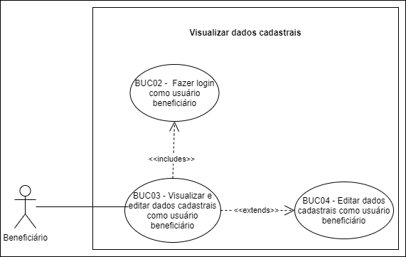

# BUC03 - Visualizar dados cadastrais como usuário beneficiário

## Diagrama

## Descrição

O usuário beneficiário deve poder visualizar seus dados cadastrais.

## Atores

Usuário beneficiário.

## Pré-requisitos

O usuário beneficiário deve estar logado na aplicação.

## Fluxo de Eventos

### Fluxo Principal

1. O usuário beneficiário seleciona o botão “DADOS CADASTRAIS”.
2. O usuário beneficiário é redirecionado para o formulário com os dados cadastrais.
3. O usuário beneficiário visualiza os dados do formulário.

### Fluxo Alternativo

Não há fluxos alternativos.

### Fluxos de Exceção

Não há fluxos de exceção.

## Pós-condição

O usuário beneficiário poderá visualizar seus dados cadastrais.

## Versionamento

|    Data    | Versão |                        Descrição                         |                            Autor(es)                             |
| :--------: | :----: | :------------------------------------------------------: | :--------------------------------------------------------------: |
| 06/10/2020 | 1.0 | Criação do caso de uso | [Ithalo Azevedo](https://github.com/ithaloazevedo) |
| 06/10/2020 | 1.0 | Revisão do caso de uso | Aline Lermen |
