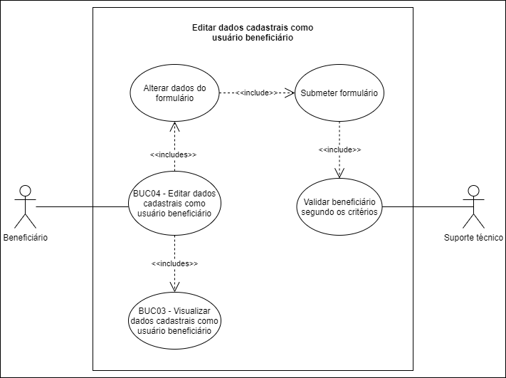

# BUC04 - Editar dados cadastrais como usuário beneficiário

## Diagrama

## Descrição
O usuário beneficiário deve poder editar seus dados cadastrais.

## Atores
Usuário beneficiário.
Suporte técnico.

## Pré-requisitos
O usuário beneficiário deve estar logado na aplicação.

## Fluxo de Eventos

### Fluxo Principal
O usuário beneficiário seleciona o botão “DADOS CADASTRAIS”.
O usuário beneficiário é redirecionado para o formulário com os dados cadastrais.
O usuário beneficiário altera os dados do formulário.
O usuário beneficiário seleciona o botão “SALVAR”.
O sistema enviará as alterações ao suporte técnico.
O suporte técnico valida os dados cadastrais do beneficiário.
Os dados cadastrais são aprovados.

### Fluxo Alternativo
Não há fluxos alternativos.

### Fluxos de Exceção
*FE01*: Dados cadastrais não se enquadram nos critérios (https://doarti.com.br/#criterios).
1. O usuário beneficiário seleciona o botão “DADOS CADASTRAIS”.
2. O usuário beneficiário é redirecionado para o formulário com os dados cadastrais.
3. O usuário beneficiário altera os dados do formulário.
4. O usuário beneficiário seleciona o botão “SALVAR”.
5. O sistema enviará as alterações ao suporte técnico.
6. O suporte técnico valida os dados cadastrais do beneficiário.
7. Os dados cadastrais são reprovados.

## Pós-condição
Os dados cadastrais do usuário beneficiário agora serão atualizados.

## Versionamento
| 06/10/2020 | 1.0 | Criação do caso de uso | [Ithalo Azevedo](https://github.com/ithaloazevedo) |
| 06/10/2020 | 1.0 | Revisão do caso de uso | Aline Lermen |
