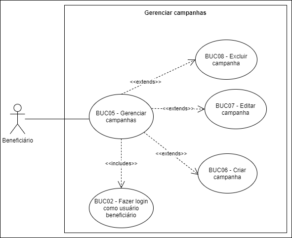

# BUC05 - Gerenciar campanhas

## Diagrama

## Descrição

O usuário beneficiário deve poder gerenciar campanhas.

## Atores

Usuário beneficiário.

## Pré-requisitos

O usuário beneficiário deve estar logado na aplicação.

## Fluxo de Eventos

### Fluxo Principal

1. O usuário beneficiário seleciona o botão “CAMPANHAS”.
2. O usuário beneficiário é redirecionado para a página de campanhas.

### Fluxo Alternativo

Não há fluxos alternativos.

### Fluxos de Exceção

Não há fluxos alternativos.

## Pós-condição

O usuário beneficiário poderá visualizar a página de campanhas.

## Versionamento

|    Data    | Versão |                        Descrição                         |                            Autor(es)                             |
| :--------: | :----: | :------------------------------------------------------: | :--------------------------------------------------------------: |
| 06/10/2020 | 1.0 | Criação do caso de uso | [Ithalo Azevedo](https://github.com/ithaloazevedo) |
| 06/10/2020 | 1.0 | Revisão do caso de uso | Aline Lermen |
