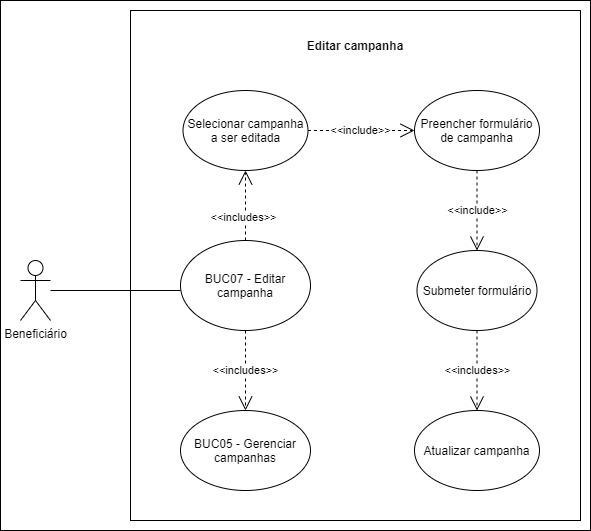

# BUC07 - Editar campanha

## Diagrama

## Descrição

O usuário beneficiário deve poder editar campanhas.

## Atores

Usuário beneficiário.

## Pré-requisitos

O usuário beneficiário deve estar logado na aplicação.
Deve existir pelo menos uma campanha já criada.

## Fluxo de Eventos

### Fluxo Principal

1. O usuário beneficiário seleciona o botão “CAMPANHAS”.
2. O usuário beneficiário é redirecionado para a página de campanhas.
3. O usuário beneficiário seleciona a campanha que quer editar.
4. O usuário beneficiário preenche o formulário da campanha.
5. O usuário beneficiário clica no botão “SALVAR”.
6. O formulário é submetido.

### Fluxo Alternativo

Não há fluxos alternativos.

### Fluxos de Exceção

**FE01**: Algum dos campos obrigatórios do formulário não foi preenchido.
1. O usuário beneficiário seleciona o botão “CAMPANHAS”.
2. O usuário beneficiário é redirecionado para a página de campanhas.
3. O usuário beneficiário seleciona a campanha que quer editar.
4. O usuário beneficiário preenche o formulário da campanha.
5. O usuário beneficiário clica no botão “SALVAR”.
6. O sistema retorna um erro informando o(s) campo(s) obrigatório(s) que não foi(foram) preenchido(s).

## sPós-condição

A campanha será atualizada com as alterações feitas.

## Versionamento
|    Data    | Versão |                        Descrição                         |                            Autor(es)                             |
| :--------: | :----: | :------------------------------------------------------: | :--------------------------------------------------------------: |
| 06/10/2020 | 1.0 | Criação do caso de uso | [Ithalo Azevedo](https://github.com/ithaloazevedo) |
| 06/10/2020 | 1.0 | Revisão do caso de uso | Aline Lermen |
| 27/11/2020 | 1.1 | Revisão final do documento | [Marcos Raimundo](https://github.com/MarcosFloresta) |
