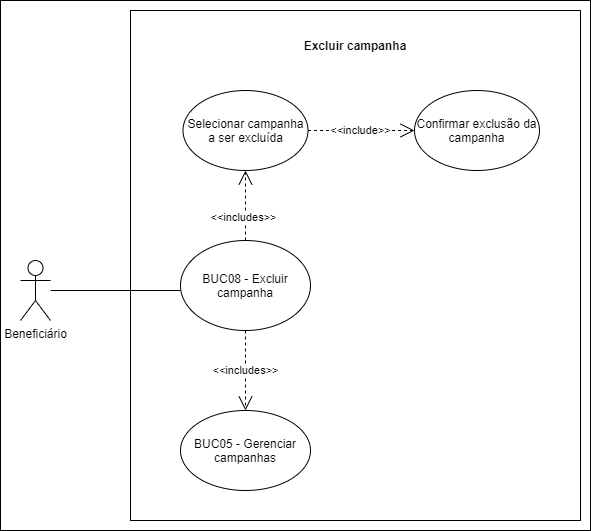

# BUC08 - Excluir campanha

## Diagrama

## Descrição

O usuário beneficiário deve poder excluir campanhas.

## Atores

Usuário beneficiário.

## Pré-requisitos

O usuário beneficiário deve estar logado na aplicação.
Deve existir pelo menos uma campanha já criada.

## Fluxo de Eventos

### Fluxo Principal

1. O usuário beneficiário seleciona o botão “CAMPANHAS”.
2. O usuário beneficiário é redirecionado para a página de campanhas.
3. O usuário beneficiário seleciona a campanha que quer excluir.
4. Uma mensagem de confirmação será apresentada ao usuário.
5. O usuário beneficiário clica no botão “SIM”.
6. A campanha selecionada será excluída.

### Fluxo Alternativo

Não há fluxos alternativos.

### Fluxos de Exceção

Não há fluxos de exceção.

### Pós-condição

A campanha será excluída.

## Versionamento

|    Data    | Versão |                        Descrição                         |                            Autor(es)                             |
| :--------: | :----: | :------------------------------------------------------: | :--------------------------------------------------------------: |
| 06/10/2020 | 1.0 | Criação do caso de uso | [Ithalo Azevedo](https://github.com/ithaloazevedo) |
| 06/10/2020 | 1.0 | Revisão do caso de uso | Aline Lermen |
