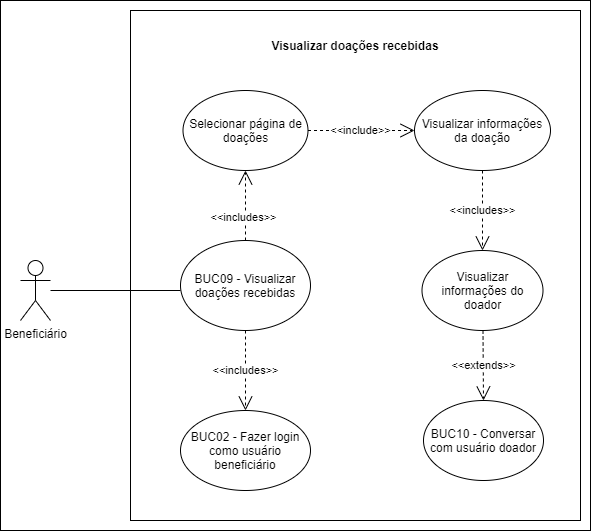

# BUC09 - Visualizar doações recebidas

## Diagrama

## Descrição

O usuário beneficiário deve poder visualizar as doações recebidas.

## Atores

Usuário beneficiário.

## Pré-requisitos

O usuário beneficiário deve estar logado na aplicação.
Devem existir doações.

## Fluxo de Eventos

### Fluxo Principal

1. O usuário beneficiário seleciona o botão “DOAÇÕES”.
2. O usuário beneficiário é redirecionado para a página de doações.

### Fluxo Alternativo

Não há fluxos alternativos.

### Fluxos de Exceção

Não há fluxos de exceção.

## Pós-condição

O usuário beneficiário visualiza as doações recebidas e informações das doações, como doador, contato do doador e status da doação.

## Versionamento

|    Data    | Versão |                        Descrição                         |                            Autor(es)                             |
| :--------: | :----: | :------------------------------------------------------: | :--------------------------------------------------------------: |
| 06/10/2020 | 1.0 | Criação do caso de uso | [Ithalo Azevedo](https://github.com/ithaloazevedo) |
| 06/10/2020 | 1.0 | Revisão do caso de uso | Aline Lermen |
