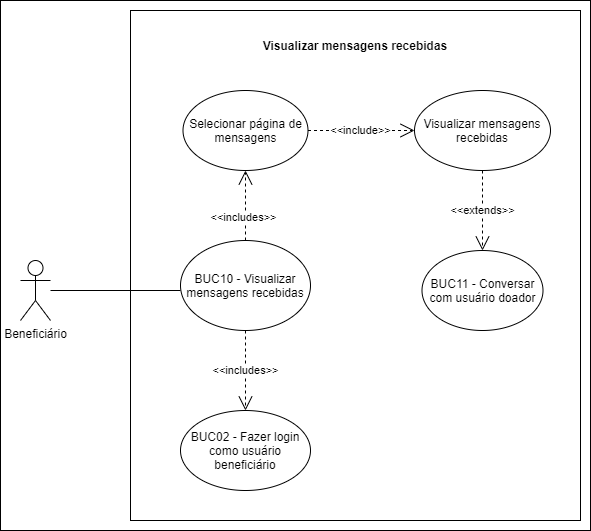

# BUC10 - Visualizar mensagens

## Diagrama

## Descrição
O usuário beneficiário deve poder visualizar as doações recebidas.

## Atores
Usuário beneficiário.

## Pré-requisitos
O usuário beneficiário deve estar logado na aplicação.
Deve existir pelo menos uma doação.
Deve existir pelo menos uma mensagem.

## Fluxo de Eventos

### Fluxo Principal
1. O usuário beneficiário seleciona o botão “MENSAGENS”.
2. O usuário beneficiário é redirecionado para a página de mensagens.

### Fluxo Alternativo
Não há fluxos alternativos.

### Fluxos de Exceção
Não há fluxos de exceção.

### Pós-condição
O usuário beneficiário visualiza as mensagens recebidas dos doadores.

## Versionamento
|    Data    | Versão |                        Descrição                         |                            Autor(es)                             |
| :--------: | :----: | :------------------------------------------------------: | :--------------------------------------------------------------: |
| 06/10/2020 | 1.0 | Criação do caso de uso | [Ithalo Azevedo](https://github.com/ithaloazevedo) |
| 06/10/2020 | 1.0 | Revisão do caso de uso | Aline Lermen |
