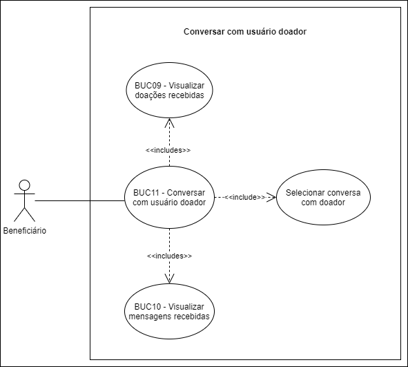

# BUC11 - Conversar com usuário doador

## Diagrama

## Descrição
O usuário beneficiário deve poder conversar com os usuários do tipo doador.

## Atores
Usuário beneficiário.

## Pré-requisitos
O usuário beneficiário deve estar logado na aplicação.
Devem existir doações.
Devem existir mensagens.

## Fluxo de Eventos

### Fluxo Principal
1. O usuário beneficiário seleciona o botão “MENSAGENS”.
2. O usuário beneficiário é redirecionado para a página de mensagens.
3. O usuário beneficiário seleciona a conversa de um doador.
4. O usuário beneficiário é redirecionado para o chat com o doador escolhido.

### Fluxo Alternativo
**FA01**: Fluxo da página de doações.
1. O usuário beneficiário seleciona o botão “DOAÇÕES”.
2. O usuário beneficiário é redirecionado para a página de doações.
3. O usuário beneficiário seleciona um doador.
4. O usuário beneficiário é redirecionado para o chat com o doador escolhido.

### Fluxos de Exceção
Não há fluxos de exceção.

## Pós-condição
O usuário beneficiário poderá conversar com o doador escolhido através de um chat.

