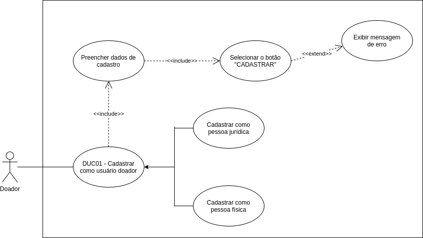

# DUC01 - Cadastrar como usuário doador

## Diagrama

## Descrição
O usuário doador deve poder se cadastrar no aplicativo

## Atores
Usuário doador

## Pré-requisitos
O usuário doador deve possuir um endereço de e-mail.  
O e-mail utilizado para cadastro não pode ter sido utilizado no cadastro de outra conta.  

## Fluxo de Eventos

### Fluxo Principal
O usuário doador entra no aplicativo Doarti  
O usuário doador seleciona alguma das campanhas que estão na seção “Home”  
O usuário seleciona o botão “QUERO DOAR”  
O usuário é redirecionado para a página de login  
O usuário doador que não possui cadastro seleciona a opção “Cadastre-se aqui”  
O usuário doador informa se é uma pessoa física ou jurídica  
O usuário doador preenche os dados de cadastro  
O usuário doador seleciona o botão “CADASTRAR”  

### Fluxos Alternativos
Não há fluxos alternativos

### Fluxos de Exceção
**FE01**: E-mail já cadastrado com outra conta  
O usuário doador entra no aplicativo Doarti  
O usuário doador seleciona alguma das campanhas que estão na seção “Home”  
O usuário seleciona o botão “QUERO DOAR”  
O usuário é redirecionado para a página de login  
O usuário doador seleciona a opção “Cadastre-se aqui”  
O usuário doador informa se é uma pessoa física ou jurídica  
O usuário doador preenche os dados de cadastro com um e-mail já cadastrado  
O usuário doador seleciona o botão “CADASTRAR”  
O sistema exibe uma mensagem informando que o e-mail já foi cadastrado com outra conta  

## Pós-condição
O usuário doador agora poderá realizar o login através do e-mail cadastrado, para poder acessar seu perfil, poder realizar doações e conversar com o usuário beneficiário pelo chat, bem como visualizar seu futuro histórico de doações.