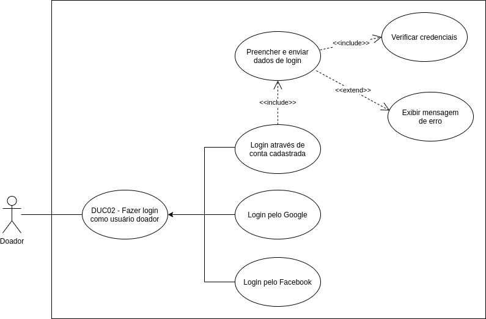

# DUC02 - Fazer login como usuário doador  

## Diagrama  

## Descrição  
O usuário doador deve poder fazer login no aplicativo  
 
## Atores  
Usuário doador  

## Pré-requisitos  
O usuário doador deve possuir um endereço de e-mail, ou possuir uma conta no Google ou Facebook.  

## Fluxo de Eventos  

### Fluxo Principal  
O usuário doador entra no aplicativo Doarti  
O usuário doador seleciona alguma das campanhas que estão na seção “Home”  
O usuário doador seleciona o botão “QUERO DOAR”  
O usuário doador que não está logado é redirecionado para a página de login  
O usuário doador preenche os dados de login  
O usuário doador seleciona o botão “ENTRAR”  
O sistema verifica as credenciais e as valida  
O usuário doador passa a estar logado  

### Fluxos Alternativos  
**FA01:** Login com o Google  
O usuário doador entra no aplicativo Doarti  
O usuário doador seleciona alguma das campanhas que estão na seção “Home”  
O usuário doador seleciona o botão “QUERO DOAR”  
O usuário doador que não está logado é redirecionado para a página de login  
O usuário doador seleciona o botão “Entrar com o Google”  
**FA02:** Login com o Facebook  
O usuário doador entra no aplicativo Doarti  
O usuário doador seleciona alguma das campanhas que estão na seção “Home”  
O usuário doador seleciona o botão “QUERO DOAR”  
O usuário doador que não está logado é redirecionado para a página de login  
O usuário doador seleciona o botão “Entrar com o Facebook”  

### Fluxos de Exceção  
**FE01:** Credenciais inválidas  
O usuário doador entra no aplicativo Doarti  
O usuário doador seleciona alguma das campanhas que estão na seção “Home”  
O usuário doador seleciona o botão “QUERO DOAR”  
O usuário doador que não está logado é redirecionado para a página de login  
O usuário doador preenche os dados de login  
O usuário doador seleciona o botão “ENTRAR”  
O sistema verifica as credenciais e não as valida  
O sistema exibe mensagem informando que as credenciais são inválidas  

## Pós-condição  
O usuário doador agora poderá acessar seu perfil, realizar doações e conversar com o usuário beneficiário pelo chat, bem como visualizar seu histórico de doações.
