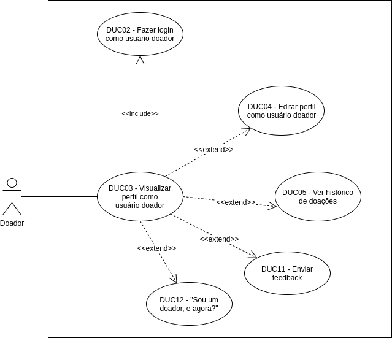

# DUC03 - Visualizar perfil como usuário doador  

## Diagrama  

## Descrição  
O usuário doador deve poder visualizar os dados do seu perfil.  

## Atores  
Usuário doador  

## Pré-requisitos  
O usuário doador deve estar logado no aplicativo.  

## Fluxo de Eventos  

### Fluxo Principal  
O usuário doador entra no aplicativo Doarti  
O usuário doador seleciona o botão “Perfil”  
O usuário doador visualiza seus dados e configuração da conta  

### Fluxos Alternativos  
*Não há fluxos alternativos*  

### Fluxos de Exceção  
*Não há fluxos alternativos* 

## Pós-condição  
O usuário doador agora poderá visualizar informações do seu perfil.

## Versionamento
|    Data    | Versão |                        Descrição                         |                            Autor(es)                             |
| :--------: | :----: | :------------------------------------------------------: | :--------------------------------------------------------------: |
| 06/10/2020 | 1.0 | Criação do caso de uso | Aline Lermen |
| 06/10/2020 | 1.0 | Revisão do caso de uso | [Ithalo Azevedo](https://github.com/ithaloazevedo) |