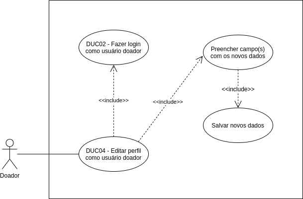

# DUC04 - Editar perfil como usuário doador

## Diagrama

## Descrição
O usuário doador deve poder editar os dados do seu perfil.  

## Atores
Usuário doador  

## Pré-requisitos
O usuário doador deve estar logado no aplicativo.  

## Fluxo de Eventos

### Fluxo Principal
O usuário doador entra no aplicativo Doarti  
O usuário doador seleciona o botão “Perfil”  
O usuário doador seleciona o botão “EDITAR PERFIL”  
O usuário doador altera os dados desejados e seleciona o botão “SALVAR”  

### Fluxos Alternativos
*Não há fluxos alternativos*  

### Fluxos de Exceção
*Não há fluxos de exceção* 

## Pós-condição
O usuário doador agora está com seus dados de perfil alterados.

