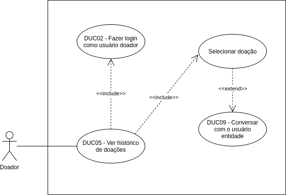

# DUC05 - Ver histórico de doações

## Diagrama

## Descrição

O usuário doador deve poder ver o seu histórico de doações (tanto em andamento, quanto concluídas).  

## Atores

Usuário doador  

## Pré-requisitos

O usuário doador deve estar logado no aplicativo.  
Deve existir pelo menos uma doação já realizada pelo usuário doador.  

## Fluxo de Eventos

### Fluxo Principal

O usuário doador entra no aplicativo Doarti  
O usuário doador seleciona o botão “Doações”  
O usuário doador seleciona alguma das doações para visualizar os dados da mesma  

### Fluxos Alternativos

**FA01:** Pelo perfil
O usuário doador entra no aplicativo Doarti  
O usuário doador seleciona o botão “Perfil”  
O usuário doador seleciona o botão “MINHAS DOAÇÕES”  
O usuário doador que não está logado é redirecionado para a página de “Doações”  
O usuário doador seleciona alguma das doações para visualizar os dados da mesma  
**FA02:** O usuário doador precisa conversar com o usuário beneficiário  
O usuário doador entra no aplicativo Doarti  
O usuário doador seleciona o botão “Doações”  
O usuário doador seleciona alguma das doações para visualizar os dados da mesma  
O usuário doador seleciona o botão “INICIAR CONVERSA VIA CHAT”  
O usuário doador conversa com o usuário beneficiário pelo chat  

### Fluxos de Exceção

*Não há fluxos de exceção*  

## Pós-condição

O usuário doador visualizou o status das doações e suas informações.  

## Versionamento

|    Data    | Versão |                        Descrição                         |                            Autor(es)                             |
| :--------: | :----: | :------------------------------------------------------: | :--------------------------------------------------------------: |
| 06/10/2020 | 1.0 | Criação do caso de uso | Aline Lermen |
| 06/10/2020 | 1.0 | Revisão do caso de uso | [Ithalo Azevedo](https://github.com/ithaloazevedo) |
| 27/11/2020 | 1.1 | Revisão final do documento | [Marcos Raimundo](https://github.com/MarcosFloresta) |
