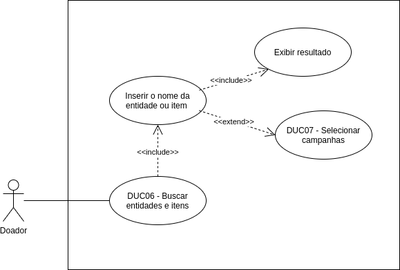

# DUC06 - Buscar entidades e itens

## Diagrama

## Descrição

O usuário doador deve poder buscar por entidades e itens de doação  

## Atores

Usuário doador  

## Pré-requisitos

## Fluxo de Eventos

### Fluxo Principal

O usuário doador entra no aplicativo Doarti  
O usuário doador, na seção “Home”, seleciona a barra de pesquisa e digita o nome de uma entidade ou campanha que deseja buscar  
Os resultados da busca aparecem, mostrando as campanhas correspondentes à pesquisa  
O usuário doador seleciona alguma das campanhas  

### Fluxos Alternativos

**FA01:** Busca por itens de doação  
O usuário doador entra no aplicativo Doarti  
O usuário doador, na seção “Home”, seleciona a barra de pesquisa e digita um item que deseja buscar  
Os resultados da busca aparecem, mostrando as campanhas que necessitam daquele item pesquisado  
O usuário doador seleciona alguma das campanhas  

### Fluxos de Exceção

*Não há fluxos de exceção*  

## Pós-condição

O usuário doador recebe os resultados de sua busca.

## Versionamento

|    Data    | Versão |                        Descrição                         |                            Autor(es)                             |
| :--------: | :----: | :------------------------------------------------------: | :--------------------------------------------------------------: |
| 06/10/2020 | 1.0 | Criação do caso de uso | Aline Lermen |
| 06/10/2020 | 1.0 | Revisão do caso de uso | [Ithalo Azevedo](https://github.com/ithaloazevedo) |
| 27/11/2020 | 1.1 | Revisão final do documento | [Marcos Raimundo](https://github.com/MarcosFloresta) |
