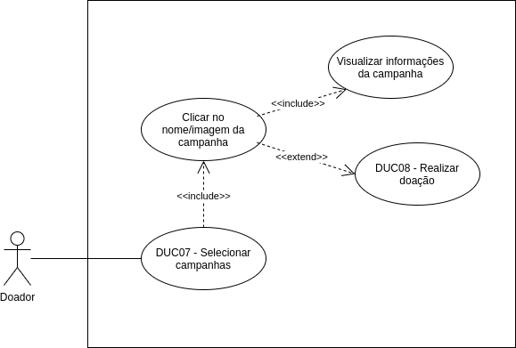

# DUC07 - Selecionar campanhas

## Diagrama

## Descrição
O usuário doador deve poder selecionar uma campanha e visualizar informações da mesma.  

## Atores
Usuário doador  

## Pré-requisitos

## Fluxo de Eventos

### Fluxo Principal
O usuário doador entra no aplicativo Doarti  
O usuário doador, na seção “Home”, seleciona alguma das campanhas apresentadas  

### Fluxos Alternativos
**FA01:** Selecionar após busca  
O usuário doador entra no aplicativo Doarti  
O usuário doador, na seção “Home”, seleciona a barra de pesquisa e digita o nome de uma entidade ou campanha que deseja buscar  
Os resultados da busca aparecem, mostrando as campanhas correspondentes à pesquisa  
O usuário doador seleciona alguma das campanha  

### Fluxos de Exceção
*Não há fluxos de exceção*  

## Pós-condição
O usuário doador pode visualizar as informações da campanha.  

