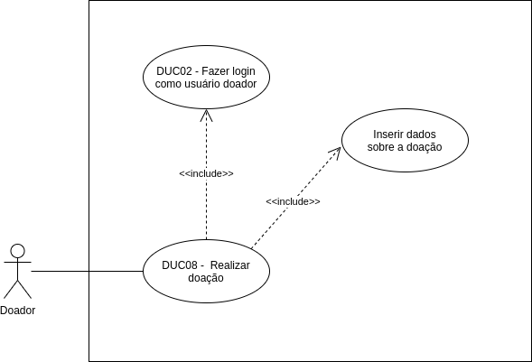

# DUC08 - Realizar doação

## Diagrama

## Descrição
O usuário doador deve poder realizar doações.  

## Atores
Usuário doador  

## Pré-requisitos
O usuário doador deve estar logado no aplicativo.  

## Fluxo de Eventos

### Fluxo Principal
O usuário doador entra no aplicativo Doarti  
O usuário doador, na seção “Home”, seleciona alguma das campanhas apresentadas  
O usuário doador seleciona o botão “QUERO DOAR”  
O usuário doador informa o que deseja doar, qual a quantidade, se pode entregar a doação na entidade, e os seu telefone e WhatsApp  

### Fluxos Alternativos
*Não há fluxos alternativos*  

### Fluxos de Exceção
*Não há fluxos de exceção*  

## Pós-condição
O usuário doador pode realizar a doação para o usuário beneficiário.  

