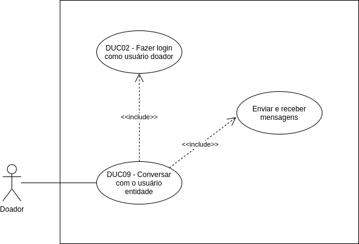

# DUC09 - Conversar com o usuário entidade

## Diagrama

## Descrição
O usuário doador deve poder conversar com o usuário beneficiário através do chat.  

## Atores
Usuário doador  

## Pré-requisitos
O usuário doador deve estar logado no aplicativo.  

## Fluxo de Eventos

### Fluxo Principal
O usuário doador entra no aplicativo Doarti  
O usuário doador seleciona o botão “Doações”  
O usuário doador seleciona alguma das doações para visualizar os dados da mesma  
O usuário doador seleciona o botão “INICIAR CONVERSA VIA CHAT”  
O usuário doador conversa com o usuário beneficiário pelo chat  

### Fluxos Alternativos
**FA01:** O usuário doador já iniciou a conversa  
O usuário doador entra no aplicativo Doarti  
O usuário doador seleciona o botão “Chat”  
O usuário doador visualiza suas conversas já existentes  
O usuário doador pode selecioná-las e enviar e receber mensagens  

### Fluxos de Exceção
*Não há fluxos de exceção*  

## Pós-condição
O usuário doador pode se comunicar com o usuário beneficiário pelo chat.  

## Versionamento
|    Data    | Versão |                        Descrição                         |                            Autor(es)                             |
| :--------: | :----: | :------------------------------------------------------: | :--------------------------------------------------------------: |
| 06/10/2020 | 1.0 | Criação do caso de uso | Aline Lermen |
| 06/10/2020 | 1.0 | Revisão do caso de uso | [Ithalo Azevedo](https://github.com/ithaloazevedo) |

