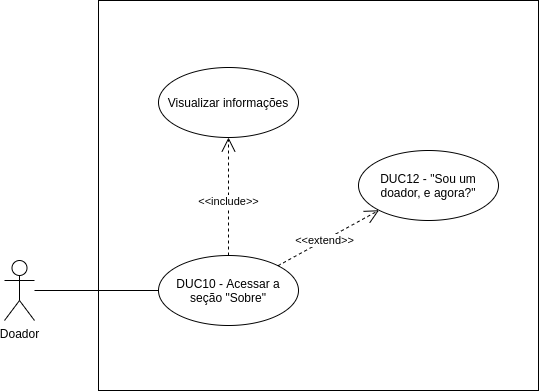

# DUC10 - Acessar a seção “Sobre”

## Diagrama

## Descrição
O usuário doador deve poder acessar a seção “Sobre” do aplicativo: “O que é o Doarti?”.  

## Atores
Usuário doador  

## Pré-requisitos

## Fluxo de Eventos

### Fluxo Principal
O usuário doador entra no aplicativo Doarti  
O usuário doador seleciona o botão “Sobre”  
O usuário doador visualiza as informações disponíveis sobre o aplicativo  
O usuário doador pode selecionar algum botão que o redirecione para outra tela ou página  

### Fluxos Alternativos
*Não há fluxos alternativos*  

### Fluxos de Exceção
*Não há fluxos de exceção*  

## Pós-condição
O usuário doador pode visualizar as informações da seção “Sobre”.  

