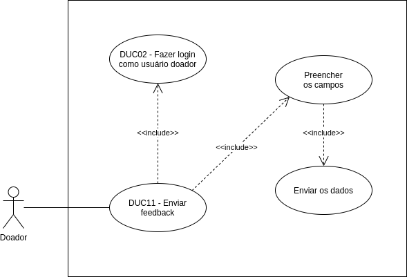

# DUC11 - Enviar feedback

## Diagrama

## Descrição
O usuário doador deve poder enviar um feedback sobre o aplicativo.  

## Atores
Usuário doador  

## Pré-requisitos
O usuário doador deve estar logado no aplicativo.  

## Fluxo de Eventos

### Fluxo Principal
O usuário doador entra no aplicativo Doarti  
O usuário doador seleciona o botão “Perfil”  
O usuário doador seleciona o botão “ENVIE-NOS SEU FEEDBACK”  
O usuário doador avalia o app e acrescenta observações  
O usuário doador seleciona o botão “Enviar”, enviando, assim, o seu feedback  

### Fluxos Alternativos
*Não há fluxos alternativos*  

### Fluxos de Exceção
*Não há fluxos de exceção*  

## Pós-condição
O usuário doador pode enviar seu feedback.  

## Versionamento
| 06/10/2020 | 1.0 | Criação do caso de uso | Aline Lermen |
| 06/10/2020 | 1.0 | Revisão do caso de uso | [Ithalo Azevedo](https://github.com/ithaloazevedo) |

