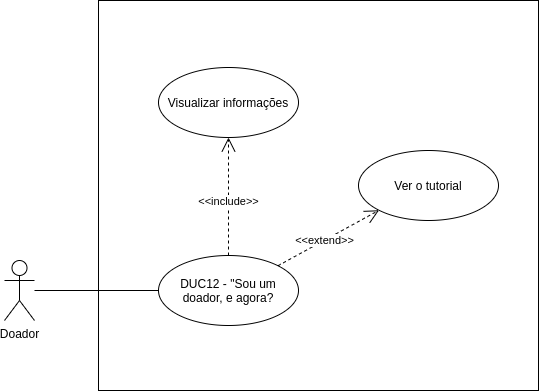

# DUC12 - “Sou um doador, e agora?”

## Diagrama

## Descrição
O usuário doador deve poder acessar a tela “Sou um doador, e agora?”, que contém informações e um tutorial.  

## Atores
Usuário doador  

## Pré-requisitos

## Fluxo de Eventos

### Fluxo Principal
O usuário doador entra no aplicativo Doarti  
O usuário doador seleciona o botão “Sobre”  
O usuário doador visualiza as informações disponíveis sobre o aplicativo  
O usuário doador seleciona o botão “Sou um doador, e agora?”  
O usuário doador é redirecionado para a tela “Sou um doador, e agora?”   
O usuário doador visualiza as informações  
O usuário doador seleciona o botão “VEJA O TUTORIAL”  

### Fluxos Alternativos
FA01: Pelo perfil
O usuário doador entra no aplicativo Doarti  
O usuário doador seleciona o botão “Perfil”  
O usuário doador seleciona o botão “COMO DOAR?”  
O usuário doador é redirecionado para a tela “Sou um doador, e agora?”   
O usuário doador visualiza as informações  
O usuário seleciona o botão “VEJA O TUTORIAL”  

### Fluxos de Exceção
*Não há fluxos de exceção*  

## Pós-condição
O usuário doador pode visualizar as informações sobre “Sou um doador, e agora?” e ver o tutorial.  

## Versionamento
| 06/10/2020 | 1.0 | Criação do caso de uso | Aline Lermen |
| 06/10/2020 | 1.0 | Revisão do caso de uso | [Ithalo Azevedo](https://github.com/ithaloazevedo) |