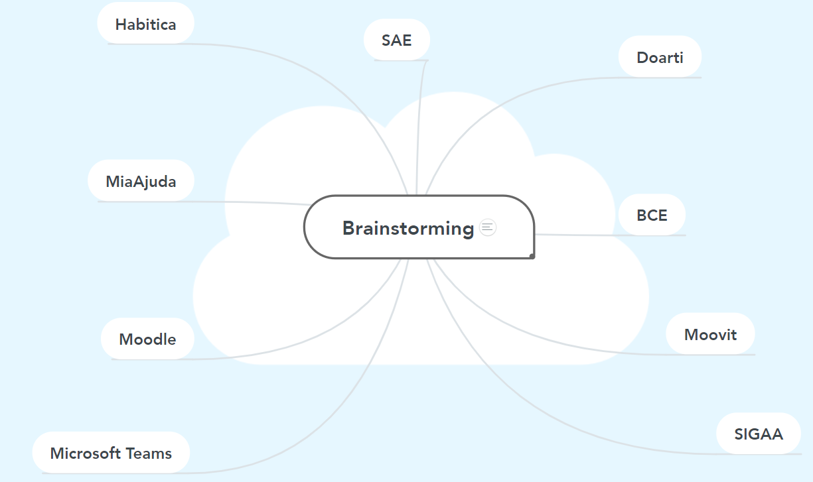

## Introdução
O planejamento é um artefato que define a organização inicial do projeto. Nele são descritos: ferramentas que irão ser utilizadas, cronogramas, meios de comunicação da equipe, organização, metodologias e estruturação do projeto.

## Escolha do App
Durante a fase do planejamento da equipe nos reunimos algumas vezes para escolher o app. Na primeira reunião, como tivemos uma certa dificuldade na escolha do app para ser tema do nosso projeto da disciplina, optamos por fazer um brainstorming de apps que se enquadrassem em 4 requisitos: 
- Tenha um escopo que não seja grande.
- Não tenha documentação já existente.
- Não seja de uma empresa grande.
- Seja gratuito. 

Após o Brainstorming ter sido feito, cada integrante do grupo escolheu um dos apps selecionados, para utilizar durante a semana e realizar a atividade individual da disciplina: Projeto Richpicture (entregue no dia 02 de setembro). Depois disso, nos reunimos e escolhemos o Doarti. Por fim, pedimos a autorização do coordenador do Doarti para a utilizarmos ele como tema do projeto. 

## Ferramentas

| Ferramenta      | Descrição                                                                                |
| --------------- | ---------------------------------------------------------------------------------------- |
| [Git](https://git-scm.com/ )             | Ferramenta utilizada para o controle e versionamento do código. |
| [Github](https://github.com/)         | Plataforma onde será hospedado o repositório do código da aplicação.  |
| [Telegram](https://telegram.org/)        | Utilizado para comunicação entre o grupo                                                 |
| [Microsoft Teams](https://www.microsoft.com/pt-br/microsoft-365/microsoft-teams/free) | Utilizado para fazer chamadas de vídeo entre o grupo e o professor                       |
| [MindMeister](https://www.mindmeister.com/pt/) | Utilizado para fazer os brainstormings                       |
| [StoryboardThat](https://www.storyboardthat.com/pt) | Ferramenta para criação dos storyboard |
| [Youtube](https://www.youtube.com/ )             | Plataforma para postarmos os videos das apresentações |

## Labels

## Cronograma de entregas

|              Módulo               |                       Descrição                        | Data planejada | Data limite |
| :-------------------------------: | :----------------------------------------------------: | :------------: | :---------: |
|        Pré-rastreabilidade        |                      RichPictures                      |   01/09/2020   | 02/09/2020  |
|           Planejamento            |     Ferramentas, equipe, cronograma e planejamento     |   05/09/2020   | 07/09/2020  |
|            Elicitação             |  Priorização, introspecção, brainstorm, questionário   |   26/09/2020   | 28/09/2020  |
| Modelagem - Inicial e Tradicional | Cenários , léxico, use case, especificação suplementar |   07/10/2020   | 09/10/2020  |
|         Modelagem - Ágil          |           Histórias de usuário, backlog, NFR           |   26/10/2020   | 28/10/2020  |
|              Análise              |                 Verificação, validação                 |   07/11/2020   | 09/11/2020  |
|        Pós-rastreabilidade        |              Forward-From, Backward-From               |   25/11/2020   | 26/11/2020  |

## Históricos de Revisões

|    Data    | Versão |                         Descrição                          |            Autor(es)             |
| :--------: | :----: | :--------------------------------------------------------: | :------------------------------: |
| 07/09/2020 |  1.0   |                   Criação do documento.                    | [Ithalo Azevedo](https://github.com/ithaloazevedo), Marcos Cabeceira |
| 10/09/2020 |  1.1   | Revisão do documento e correção do link de uma das imagens |          [Ithalo Azevedo](https://github.com/ithaloazevedo)          |
| 16/11/2020 |  1.2   |           Adição de informações sobre o projeto            |          [Ithalo Azevedo](https://github.com/ithaloazevedo)          |
| 17/11/2020 |  1.3   |           Atualização das ferramentas utilizadas           |          [Ithalo Azevedo](https://github.com/ithaloazevedo)         |

