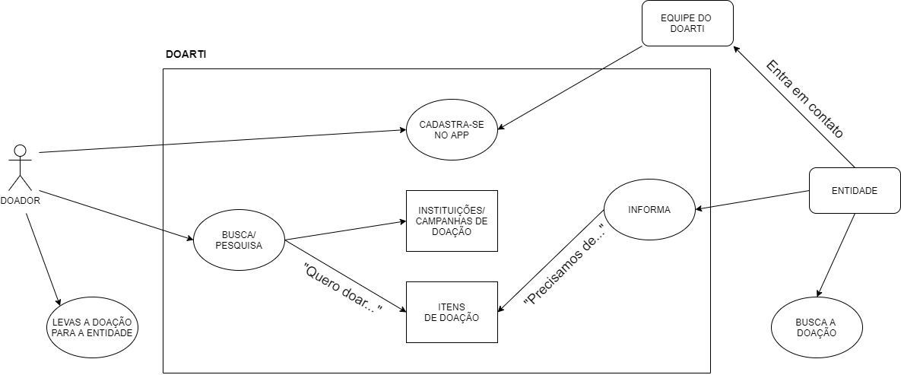

# Rich Picture

Rich picture é uma técnica que tem como objetivo entender o processo da interação do usuário com o sistema. Através dele abstraimos de forma de diagramas e imagens as ações do usuário e os elementos do sistema envolvidos no processo. 

## Rich Pictures 

### Ithalo Azevedo

### Aline Lermen

---
## Rich Picture Final

---
## Referências

- Rich Pictures: <http://systems.open.ac.uk/materials/T552/pages/rich/richAppendix.html>. 

## Históricos de Revisões
|    Data    | Versão |         Descrição         |           Autor(es)            |
| :--------: | :----: | :-----------------------: | :----------------------------: |
| 25/09/2020 |  1.0   |  Criação de Rich Picture individual. | [Ithalo Azevedo](https://github.com/ithaloazevedo) | 
| 25/09/2020 |  1.0   |  Adição do Rich Picture individual. | Aline Lermen | 
| 24/11/2020 | 2.0 | Criação do Rich Picture revisado, com base no feedback do professor | [Marcos Raimundo](https://github.com/MarcosFloresta) |
